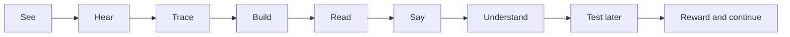
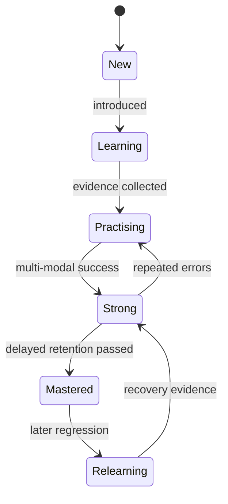
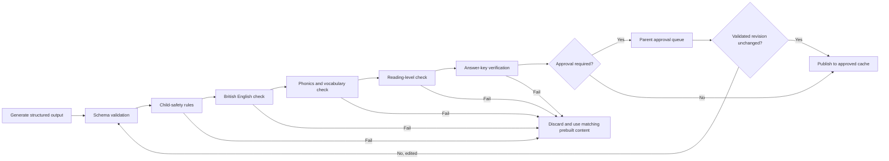
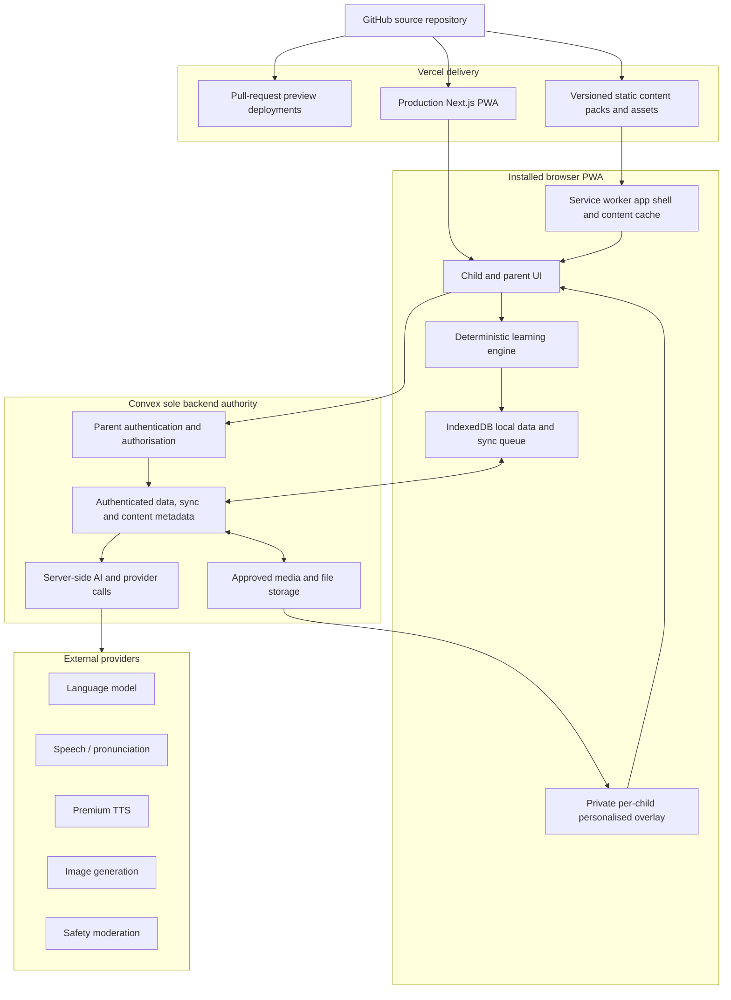

# Malachi Learning Adventure
## Product Requirements Document

| Field | Value |
|---|---|
| Document | `Wawi Learns PRD.md` |
| Version | 1.0 |
| Status | Approved product scope for implementation planning |
| Date | 8 August 2026 |
| Product owner | Mike Jones |
| Primary learner | Malachi, age 6 |
| Working product name | Malachi Learning Adventure |
| Primary language | British English (`en-GB`) |
| Initial curriculum coverage | England Reception and Year 1 |
| Initial release | Installable Next.js PWA hosted on Vercel |
| Repository | GitHub |
| Cloud backend | Convex |
| AI approach | Server-side OpenRouter text generation plus dedicated services where justified; strictly controlled |

---

## 1. Purpose

Malachi Learning Adventure is a private, adaptive learning application designed to help Malachi learn to read, speak, spell, write and understand English, while also developing Reception and Year 1 mathematics skills.

The application must feel like a calm, enjoyable adventure to Malachi. Underneath the child experience, it must operate as a serious learning system that:

- identifies what Malachi already knows;
- introduces new material at an appropriate pace;
- detects individual words, sounds and skills he finds difficult;
- increases practice on weak areas without punishing him;
- checks delayed retention instead of counting one lucky answer as mastery;
- provides immediate positive feedback and long-term rewards;
- gives the parent clear evidence, explanations and controls;
- works reliably without internet access;
- uses AI only where AI improves the learning experience;
- protects the privacy and best interests of the child.

This PRD defines the complete Version 1 product. Version 1 is intentionally broader than a narrow minimum viable product. It includes the full English learning experience, maths, adaptive learning, speech, handwriting, stories, AI, rewards, parent reporting, offline use and installable PWA delivery.

---

## 2. Requirement language

The following words have fixed meanings:

- **MUST**: mandatory for Version 1 release.
- **SHOULD**: expected unless an implementation spike proves a better solution.
- **MAY**: optional enhancement that must not delay mandatory requirements.
- **Parent**: the authenticated adult responsible for the child profile.
- **Learner**: Malachi in Version 1.
- **Mastery**: retained, multi-modal evidence that a skill is known, not a single correct answer.
- **Core content**: human-reviewed curriculum content that is available without AI.
- **Generated content**: content produced or materially modified by AI.
- **Private personalised overlay**: an authenticated, per-child manifest and approved generated assets held by Convex and downloaded into isolated local storage without changing or publishing into the shared prebuilt core pack.

---

## 3. Confirmed product decisions

| Decision | Confirmed requirement |
|---|---|
| Version 1 scope | Full vision: English, maths, adaptive learning, speech, handwriting, AI stories, custom packs, rewards and parent reporting |
| Curriculum | UK-aligned, using the current England Reception and Year 1 framework as the initial backbone |
| Release model | GitHub source repository with Vercel preview and production deployments of the Next.js PWA |
| Supported PWA baseline | Android 13 through Android 17 inclusive, using Chrome stable at release and the two immediately preceding stable major versions |
| Accounts and child data | Parent account with exactly one learner profile for Malachi; no child email, independent account, add-child, selection or switching flow |
| Voice privacy | Raw voice recordings MUST NOT be stored |
| AI story approval | AI-generated stories MUST be approved by the parent before the child can open them |
| Operating budget | Controlled quality-first budget; one benchmarked low-cost paid text model, with paid speech and image services only when they materially improve learning |
| Daily learning target | Default target of 20 newly introduced words per day; mastery is measured separately |
| Session duration | No hard session limit; Malachi may continue while interested |
| Learning response | Correct answers receive positive feedback; mistakes trigger adaptive support and increased future practice |
| Parent control | Automatic by default, but the parent can override curriculum focus, content, difficulty and activities |
| Offline behaviour | Core learning, tests, tracing, rewards and progress MUST work offline after content is downloaded |

---

## 4. Product problem

The original printable workbook helps Malachi practise words, letters and numbers, but paper cannot:

- pronounce words and sounds on demand;
- determine whether a response is correct;
- give immediate, varied encouragement;
- recognise recurring mistakes;
- change the activity when one teaching method is ineffective;
- revisit weak words at useful intervals;
- distinguish recognition, comprehension, spelling, speaking and handwriting;
- remember progress across days and authorised installations;
- generate new, level-appropriate reading material;
- give the parent a clear, evidence-based progress picture.

The application must solve these limitations without becoming overstimulating, punitive or dependent on a permanent internet connection.

---

## 5. Product vision

### 5.1 Child-facing vision

Malachi mainly sees one clear action:

> **Continue My Adventure**

The application then chooses the most useful next activity. Malachi should not need to understand curriculum labels, mastery algorithms or assessment terminology.

The core learner loop is:



### 5.2 Parent-facing vision

The parent sees the underlying learning system:

- curriculum stage;
- words and sounds introduced;
- words and skills mastered;
- weak words and recurring error patterns;
- phonics, reading, spelling, handwriting, speaking and comprehension progress;
- maths progress by strand;
- the reason the system selected a learning priority;
- AI-generated plain-English summaries;
- approval queues for generated stories and images;
- controls to override the automatic plan.

### 5.3 Long-term vision

The platform must be extendable beyond Version 1 without replacing its core architecture:

**phonics → early reading → fluent reading → vocabulary → comprehension → grammar → spelling → creative writing**, with mathematics growing in parallel.

Version 1 content stops at Reception and Year 1 coverage, but the skill model, content schema and mastery engine must support Year 2 and later stages.

---

## 6. Product goals

### G-01: Improve actual reading ability

The application MUST teach decoding, whole-word recognition, vocabulary, fluency and comprehension. It must not merely train picture guessing.

### G-02: Build reliable retention

A word or skill MUST be recalled across different activity types and on different days before it is marked mastered.

### G-03: Double down intelligently on mistakes

Weak content MUST appear more frequently, through different teaching methods and at spaced intervals. The system must not simply repeat an identical question until Malachi guesses correctly.

### G-04: Keep learning positive

Wrong answers MUST NOT remove earned stars, badges or world progress. Feedback must be gentle, specific and helpful.

### G-05: Support independent use

The child interface MUST be voice-led, visually clear and usable by a learner who cannot yet read instructions confidently.

### G-06: Give the parent control and evidence

The parent MUST be able to see, understand and override the learning plan.

### G-07: Work offline

A downloaded learning pack MUST continue functioning without internet, including attempts, rewards and local progress calculation.

### G-08: Use safe, useful AI

AI MUST generate constrained educational support, not operate as an unrestricted child chatbot.

### G-09: Grow beyond 500 words

The curriculum MUST use an extensible word and skill library, not a fixed 500-word ceiling.

### G-10: Support maths through the same platform

English and mathematics MUST share the learner profile, adaptive engine, rewards, reporting, offline support and parent controls.

---

## 7. Non-goals for Version 1

Version 1 will not include:

- public social features, messaging, chat rooms or leaderboards;
- advertising, behavioural advertising or commercial reward offers;
- in-app purchases in child mode;
- an unrestricted AI conversation interface;
- clinical diagnosis of dyslexia, speech disorders, attention conditions or learning disabilities;
- raw audio recording storage;
- video recording, facial recognition or biometric identity;
- teacher, school or classroom administration accounts;
- multiple child profiles, add-child flows, child selectors or child switching;
- a user-facing content-administration studio or runtime content-authoring role;
- packaged mobile applications or store-based distribution;
- support for multiple national curricula;
- complete Year 2 or later curriculum content;
- competitive time pressure as a default learning method.

---

## 8. Users and roles

### 8.1 Learner: Malachi

Needs:

- one obvious next action;
- spoken instructions;
- large touch targets;
- immediate feedback;
- fun variety;
- forgiving tracing and pronunciation assessment;
- frequent success mixed with useful challenge;
- no shame or loss when incorrect;
- offline access.

### 8.2 Parent

Needs:

- secure account access;
- a protected parent area;
- progress reporting in plain English;
- detailed evidence when needed;
- curriculum and activity controls;
- custom word and theme packs;
- AI content approval;
- data deletion controls.

---

## 9. Learning and child-experience principles

1. **Voice first:** every instruction required to complete an activity must be playable aloud.
2. **One primary action:** learning screens should normally have one obvious required action.
3. **No punishment:** no negative points, lost rewards or harsh failure screens.
4. **No false mastery:** one correct answer does not prove knowledge.
5. **Teach before testing:** when confidence is low, show, model and practise before reassessment.
6. **Change the method:** repeated errors trigger a different activity type.
7. **Short interaction units:** individual activities should usually take seconds, even when the overall session is long.
8. **Unlimited session, managed variety:** no hard timer, but the engine rotates activity types and may offer gentle movement or water breaks.
9. **Calm during learning, stronger celebration for success:** the base interface is focused; major rewards can be more animated.
10. **Accent fairness:** British English spelling and teaching targets must not be used to punish an intelligible Zimbabwean, South African or other English accent.
11. **Explainability:** parent-facing decisions must be traceable to actual attempts and rules.
12. **Offline continuity:** no core activity should end abruptly because connectivity is lost.
13. **Child safety by default:** minimum data collection, no dark patterns and no unrestricted external content.

---

## 10. Curriculum foundation

### 10.1 Alignment

Version 1 MUST use a Department for Education-led curriculum authority:

- the current England Early Years Foundation Stage framework for Reception;
- the current England National Curriculum English programme for Year 1;
- the current England National Curriculum Mathematics programme for Year 1;
- the Department for Education Reading Framework for systematic synthetic phonics, decoding, spelling, fluency and comprehension.

The application MUST maintain its own versioned grapheme-phoneme progression, derived from the DfE sources above and current published evidence on systematic synthetic phonics. The product owner MUST record the source version and content-validation result for each progression version before it is used in production. The application must describe itself as **UK-aligned**.

### 10.2 Curriculum versioning

The current national curriculum remains the operational basis in 2026, while a revised curriculum is expected to be published in 2027 for school teaching from September 2028. Therefore:

- every curriculum record MUST include a curriculum version;
- content packs MUST be tied to a curriculum version;
- progression rules MUST be replaceable without migrating historical attempt records;
- each curriculum version MUST declare the prerequisite skills, readiness evidence and activity/stage unlock rules used by the deterministic learning engine;
- the parent dashboard MUST show which curriculum version is active;
- future curriculum changes MUST be deployable as a new version rather than overwriting historical content.

### 10.2a Prebuilt core syllabus

Each curriculum version MUST include a complete prebuilt core syllabus: approved phonics progression, words, decodable sentences, stories, images, reviewed British-English audio, activities and correction cards. This pack is the primary source for teaching and MUST be available in downloaded offline content.

AI MAY create additional variety or personalisation only within the active curriculum version and its approved rules. It MUST NOT be the sole source of core teaching content, alter the curriculum sequence or block learning when unavailable.

### 10.3 Systematic synthetic phonics

The English sequence MUST explicitly teach:

- phonemic awareness;
- grapheme-phoneme correspondences;
- blending sounds to read;
- segmenting words to spell;
- cumulative revision;
- decodable words, sentences and stories matched to taught correspondences;
- common exception words;
- increasing fluency and comprehension.

Whole-word recognition MUST support phonics and common exception words. It MUST NOT replace decoding instruction.

### 10.4 Word length progression

The product must honour the requested progression from short to longer words:

- two-letter and very short words;
- three-letter words;
- four-letter words;
- five-letter and longer words;
- phrases, sentences and stories.

However, word length is a supporting difficulty signal, not the only ordering rule. A decodable three-letter CVC word may be taught before a less-decodable two-letter word. The primary sequence is phonics knowledge and decodability.

### 10.5 British English requirements

All curated and generated content MUST use:

- British English spelling;
- `en-GB` language tags;
- UK punctuation and number conventions where relevant;
- child-friendly vocabulary suitable for the curriculum stage.

Content validation MUST detect common US spellings and either convert or reject them unless the word is being taught as an explicit comparison.

---

## 11. Version 1 curriculum scope

### 11.1 English strands

| Strand | Version 1 outcomes |
|---|---|
| Listening and attention | Follow spoken instructions, listen to stories, answer relevant questions and sustain short exchanges |
| Speaking | Repeat sounds and words, use new vocabulary, speak in simple complete sentences and describe pictures/events |
| Phonological awareness | Hear, identify, blend and segment sounds; recognise rhyme, syllables and initial/final sounds |
| Phonics | Learn letter sounds, digraphs and selected trigraphs; blend and segment decodable words |
| Word reading | Read short decodable words, common exception words, phrases and Year 1-level sentences |
| Vocabulary | Learn concrete, action, descriptive, function and curriculum words in meaningful contexts |
| Fluency | Re-read known material with improving accuracy, pace and expression without time pressure |
| Comprehension | Answer literal questions, identify details, sequence events, predict and make simple inferences |
| Spelling | Letter tiles, missing letters, whole-word typing, dictated words and short dictated sentences |
| Handwriting | Trace and form upper/lowercase letters, words, numbers, then copy and write independently |
| Grammar | Capital letters, full stops, question/exclamation marks, spaces, simple sentence structure, basic word classes and tense patterns |
| Composition | Build, complete and create simple phrases and sentences using learned vocabulary |

### 11.2 Mathematics strands

| Strand | Version 1 outcomes |
|---|---|
| Number recognition and formation | Recognise, name, trace and write numbers; connect numerals to quantities |
| Counting | Count objects reliably; count forwards/backwards; count beyond 20 and towards 100 |
| Subitising | Recognise small quantities without counting |
| Place value | Compare and order numbers; understand tens and ones at Year 1 level |
| Addition and subtraction | Use objects, pictures, number lines and mental strategies; learn number bonds |
| Multiplication and division foundations | Repeated groups, arrays, sharing and grouping, especially 2s, 5s and 10s |
| Fractions foundations | Recognise and find halves and quarters of shapes, objects and small quantities |
| Patterns | Continue, describe and create visual and numerical patterns |
| Shape and space | Recognise, sort and describe common 2D and 3D shapes; position and direction |
| Measurement | Compare length, height, mass, capacity and time; recognise coins and simple money contexts |
| Reasoning | Explain choices through pictures, spoken prompts and simple problem solving |

### 11.3 Minimum curated content inventory

Before Version 1 is considered complete, the application MUST contain at least:

- **2,000 human-reviewed British English word records**;
- **800 illustrated concrete/action word records** suitable for picture activities;
- **400 curated decodable phrases and sentences**;
- **60 curated levelled mini-stories or reading passages**;
- **a complete reviewed grapheme/phoneme inventory for Reception and Year 1 scope**;
- **reviewed isolated phoneme audio** for the core phonics sequence;
- **40 or more reusable mathematics activity templates** capable of producing varied questions without unsafe randomisation;
- **a sufficient set of mathematics manipulatives and diagrams** for all listed Reception and Year 1 strands;
- **at least 20 parent-assisted activity templates**;
- **at least 50 positive feedback phrases**, grouped by context and not generated on every answer.

AI-generated content may expand this library but does not count toward the minimum curated core unless the product owner has reviewed and promoted it into the curated library.

---

## 12. Content data requirements

Each English word record MUST support the following metadata where applicable:

- canonical British spelling;
- display form and lowercase form;
- word class;
- definition suitable for a child;
- one or more example sentences;
- phoneme sequence;
- grapheme segmentation;
- syllable segmentation;
- pronunciation reference;
- curriculum band;
- decodability against each curriculum stage;
- common exception word status;
- frequency/priority band;
- word length;
- concrete/image suitability;
- image asset references;
- audio asset references;
- tracing path availability;
- spelling pattern tags;
- confusion set, such as `b/d`, `ship/shop`, or similar forms;
- allowed activity types;
- content safety status;
- content source and licence;
- review status and reviewer;
- version and deprecation status.

Each sentence and story record MUST include:

- curriculum band;
- required phonics knowledge;
- percentage of words already expected to be known;
- deliberately introduced new words;
- sentence length and complexity;
- comprehension questions and correct answers;
- narration audio where curated;
- image assets where applicable;
- review and approval status;
- source/licence metadata.

Each mathematics item or template MUST include:

- curriculum strand and skill;
- difficulty parameters;
- allowed number ranges;
- representation type;
- exact answer logic;
- common misconception tags;
- hint sequence;
- language complexity rating;
- offline asset requirements;
- validation tests.

---

## 13. Parent onboarding and learner setup

### FR-ONB-01 Parent account

The parent MUST authenticate using a parent-only method such as email one-time code, passkey or another secure identity provider compatible with Convex.

### FR-ONB-02 Parent gate

The child area MUST NOT expose account, privacy, AI approval, purchase, external link or deletion controls. Parent mode MUST require a PIN, device biometric or equivalent parent gate after the initial login.

### FR-ONB-03 Child profile

The minimum child profile should contain:

- preferred first name;
- birth year or age band rather than full date of birth where possible;
- selected interests;
- dominant hand if known;
- approximate parent-selected starting level;
- accessibility settings;
- microphone permission choice;
- daily new-word target, defaulting to 20;
- active curriculum version.

No child email address is required.

### FR-ONB-04 Parent-selected starting estimate

The parent MUST choose an approximate level before the initial assessment, for example:

- learning letters and sounds;
- beginning to blend;
- reading simple words;
- reading short sentences;
- unsure.

### FR-ONB-05 Initial adaptive assessment

The app MUST then conduct a short, game-like assessment that samples:

- letter recognition;
- letter sounds;
- oral blending and segmentation;
- short word recognition;
- listening comprehension;
- simple sentence reading where appropriate;
- number recognition and counting;
- simple quantity and operation understanding.

The assessment MUST:

- adapt upward or downward;
- stop when it has enough confidence;
- avoid presenting a visible pass/fail score to the child;
- allow the parent to skip or restart it;
- produce a starting skill profile, not a single grade.

If the parent skips the initial assessment, the first seven eligible learning sessions MUST establish the provisional baseline from observed evidence. Until a dimension has the minimum evidence required by Section 38.3, the dashboard MUST show `baseline incomplete` or `insufficient evidence` rather than infer a level or trend.

Restarting the assessment MUST create a new versioned baseline candidate without deleting earlier attempts or the audit history. It becomes the active assessment baseline only when the restarted assessment is complete.

### FR-ONB-06 Offline content download

Onboarding MUST offer:

- an essential offline pack containing the app shell and at least 14 days of varied core learning;
- a full Reception and Year 1 offline content pack;
- clear storage-size information;
- download progress and recovery after interruption.

Downloading an initial or updated pack MUST NOT displace an already active valid pack. Activation is governed by the completeness, integrity and version rules in Section 32.3.

---

## 14. Child home and navigation

### FR-CH-01 Primary action

The child home screen MUST prioritise a single button: **Continue My Adventure**.

### FR-CH-02 Daily target

The child home screen SHOULD show a simple visual representation of the daily target:

- new words introduced: `x / 20`;
- practice items completed;
- optional story or maths challenge;
- daily goal complete state.

The interface MUST distinguish:

- **introduced today**;
- **mastered today**;
- **still practising**.

Twenty new words is a target, not an automatic mastery claim.

### FR-CH-03 Unlimited continuation

After the daily target is complete, the app MUST allow Malachi to continue. It may display:

> **Daily goal complete — keep exploring!**

### FR-CH-04 Subject handling

The learning engine may mix English and maths automatically. The child MAY also choose a large English or Maths area when the parent permits manual subject selection.

### FR-CH-05 Voice-led instructions

Every child-facing instruction MUST have a visible speaker control and SHOULD play automatically the first time an activity type is introduced.

### FR-CH-06 No dead ends

Every learner screen MUST provide a safe route to:

- hear the instruction again;
- request a hint;
- pause;
- return to the child home screen.

---

## 15. Activity types and progressive unlocking

All activity types below are mandatory in Version 1. They MUST be introduced gradually when the active curriculum version’s declared prerequisite and readiness rules are satisfied.

### FR-ACT-01 Learn card

Show a word or sound with:

- a clear image where appropriate;
- written form;
- normal pronunciation;
- slow pronunciation;
- spelling mode;
- phonics breakdown;
- optional example sentence.

### FR-ACT-02 Hear word, choose picture

The app speaks a target word and shows two to four large image choices.

### FR-ACT-03 See picture, choose word

The app shows an image and asks the learner to select the matching written word.

### FR-ACT-04 Hear word, choose written word

The app speaks a target and presents written options, including carefully selected distractors.

### FR-ACT-05 Word-to-picture matching

The learner pairs words with images using drag, tap or line matching.

### FR-ACT-06 Letter and number tracing

The learner traces guided letters, words and numbers with a finger or stylus.

### FR-ACT-07 Letter-tile word building

The learner builds a word from letter or grapheme tiles. Tiles MUST progressively support:

- ordered selection with a model;
- missing-letter completion;
- full reconstruction;
- decoy letters;
- grapheme tiles for digraphs/trigraphs.

### FR-ACT-08 Spelling and typing

The progression MUST include:

- choose the missing letter;
- complete the word;
- type the complete word;
- type a dictated word;
- type a short dictated sentence at the appropriate stage.

### FR-ACT-09 Speaking and pronunciation

The progression MUST include:

- repeat a sound;
- repeat a word;
- read a word aloud;
- read a phrase;
- read a sentence;
- retell or answer verbally when ready.

### FR-ACT-10 Sentence reading

Sentences MUST primarily use already mastered or strong words. New words MUST be intentionally limited and highlighted through pre-teaching.

### FR-ACT-11 Comprehension

Question formats MUST progressively include:

- select the matching picture;
- answer what/who/where questions;
- identify colour, object or action;
- choose the correct sentence;
- fill a missing word;
- order events;
- predict what happens next;
- answer simple why/how questions;
- retell in the learner’s own words.

### FR-ACT-12 Curated story reading

The child MUST be able to hear and read curated, levelled stories with optional word highlighting and comprehension activities.

### FR-ACT-13 AI story reading

Approved AI stories MUST appear in the same reading experience as curated stories, clearly marked for the parent but not burdening the child with technical labels.

### FR-ACT-14 Mathematics interactions

Maths MUST use varied representations including:

- counters and objects;
- ten frames;
- number lines;
- arrays;
- part-whole models;
- shape sorting;
- clocks;
- coins;
- simple illustrated word problems;
- number tracing and writing.

### FR-ACT-15 Mixed mastery challenge

A mixed test MUST only unlock after the learner has received sufficient teaching. It should combine modalities rather than repeat one quiz format.

---

## 16. Adaptive lesson builder

### 16.1 Core rule

The deterministic learning engine, not an AI model, MUST decide the next skill and activity.

AI may supply constrained examples or remediation content after the engine has selected the educational objective.

### 16.2 Lesson composition

A learning sequence SHOULD combine:

- new words or skills;
- weak items;
- recently learned items;
- delayed-retention checks;
- phonics;
- spelling;
- speaking;
- handwriting;
- sentence reading;
- comprehension;
- maths;
- reward moments.

### 16.3 Default content mix

The following ratios are initial defaults and MUST be configurable:

| Weak backlog | New material | Weak-item practice | Retention review |
|---|---:|---:|---:|
| 0–4 | 55% | 30% | 15% |
| 5–10 | 35% | 45% | 20% |
| More than 10 | 15% | 60% | 25% |

The 20-word daily target remains visible. When the weak backlog is high, the engine may slow introductions and explain this in the parent dashboard. The parent can override the pacing.

### 16.4 Activity rotation

The engine MUST avoid long runs of the same interaction. It SHOULD consider:

- recent activity history;
- motor demand;
- reading demand;
- speaking demand;
- success rate;
- signs of random tapping;
- response latency;
- time in session.

### 16.5 Progressive learning and engagement baseline

The engine MUST optimise for retained learning, not time spent, streak length or raw activity completion. The initial assessment and later evidence MUST maintain a provisional, separate profile for phonics/decoding, word recognition, vocabulary/listening, comprehension and mathematics; no single activity or session may establish overall ability.

The engine SHOULD monitor participation quality, including voluntary continuation, retry after support, preferred activity modality, random tapping, repeated exits and signs of fatigue. These signals MUST only adjust pacing, activity modality or the offer of a break. They MUST NOT trigger pressure, reduce rewards, or be treated as proof of learning.

Progression MUST introduce small, evidence-led increases in challenge while preserving frequent achievable success. Delayed retention and varied activity evidence remain the basis for mastery.

### 16.6 Long sessions

There is no hard learning timer. During longer sessions the application SHOULD:

- rotate between active and quiet tasks;
- reduce repeated high-effort microphone or handwriting tasks;
- offer optional short movement/water breaks;
- preserve progress if the child exits abruptly;
- avoid guilt-based messages for stopping.

### 16.7 Automatic progression

Normal advancement MUST happen automatically when the active curriculum version’s prerequisite and readiness evidence is sufficient. The parent MUST be able to:

- hold a stage;
- move focus backward;
- make a specific stage available for teaching;
- temporarily skip a content item;
- reset a mastery state with an audit record.

A parent override MAY change focus, pacing or teaching availability, but MUST NOT create `Strong` or `Mastered` status, count as learning evidence, bypass child-safety or decodability rules for scored content, or erase immutable attempts. Content made available before its readiness prerequisites are met MUST remain teaching or practice content and MUST NOT grant progression credit. Resetting mastery changes the derived current state only; the prior state, attempts and reason for the reset MUST remain in the audit history.

---

## 17. Mastery model

### 17.1 Separate skill dimensions

The system MUST track at least these dimensions separately:

- phonics/decoding;
- visual word recognition;
- auditory word recognition;
- vocabulary understanding;
- free recall;
- speaking/pronunciation;
- spelling;
- handwriting;
- sentence reading;
- comprehension;
- maths skill mastery.

A child may recognise a word but still need spelling practice. The app MUST reinforce the weak dimension rather than unnecessarily reteaching every dimension.

Every mastery state MUST identify one skill dimension. Evidence in one dimension MAY inform scheduling, but it MUST NOT directly advance, regress or complete another dimension.

### 17.2 Mastery states

Each dimension-specific skill-item relationship MUST use the following state model:



### 17.3 Evidence record

Every attempt MUST record:

- learner ID;
- curriculum/content version;
- target skill and content item;
- activity type;
- result;
- hint level;
- number of retries;
- response time;
- independence level;
- original occurrence time and server receipt time;
- offline/online origin;
- stable source-installation ID and monotonically increasing source sequence;
- engine version;
- optional derived handwriting or pronunciation scores;
- immutable event ID used as the idempotency key.

### 17.4 Mastery rules

Default mastery rules MUST require:

- successful evidence across at least four appropriate activity modalities;
- at least six independent correct responses overall;
- evidence on at least three separate calendar days;
- at least one delayed recall check after 72 hours or more;
- no unresolved recent pattern of repeated errors;
- comprehension evidence within the comprehension dimension for meaning-bearing words;
- spelling or speaking evidence only within the corresponding spelling or speaking dimension.

These thresholds MUST be configurable by curriculum stage and skill type.

Mastery thresholds apply to one dimension at a time. A versioned curriculum rule MAY declare a different dimension as a prerequisite for a later progression step, but it MUST NOT convert that prerequisite evidence into mastery of the current dimension.

### 17.5 Hints and lucky guesses

- Correct answers after a full reveal MUST count as practice, not independent mastery evidence.
- Repeated rapid tapping MUST be detected and down-weighted.
- Hinted answers MUST carry less evidence than independent recall.
- A correct answer after multiple incorrect selections MUST not be treated as first-attempt correctness.

### 17.6 Regression

A mastered item that is repeatedly missed later MUST move into `Relearning` and re-enter the practice schedule. Historical mastery must remain visible in the audit trail.

---

## 18. Weak-word and weak-skill recovery

### FR-WEAK-01 First error

On the first error:

- offer a gentle retry;
- do not reveal the answer immediately if another thoughtful attempt is useful;
- do not remove rewards.

### FR-WEAK-02 Second error

On the second error:

- reveal and pronounce the correct answer;
- show the relevant picture or representation;
- provide a brief explanation;
- schedule the item again after other activities.

### FR-WEAK-03 Repeated error

After repeated errors, the system MUST change the teaching method. For a word this may include:

- phoneme-grapheme breakdown;
- slow blending;
- tracing;
- grapheme tiles;
- comparison with a confusion word;
- a simpler sentence;
- picture support;
- parent-assisted practice suggestion.

For maths this may include:

- smaller numbers;
- concrete objects;
- number line or ten frame;
- worked example;
- fewer answer choices;
- a simpler related prerequisite.

### FR-WEAK-04 Spaced resurfacing

A weak item SHOULD be scheduled approximately:

- after 2–4 other activities;
- later in the same session;
- in the next session;
- on the following day;
- at increasing intervals after successful recovery.

The exact schedule must be controlled by a configurable spaced-practice algorithm.

### FR-WEAK-05 Backlog control

When the weak backlog exceeds the configured threshold, the system MUST prioritise consolidation and slow new introductions rather than allowing an unmanageable queue to accumulate.

### FR-WEAK-06 Parent explanation

The parent MUST be able to open a weak item and see:

- recent attempts;
- activity types;
- errors or confusion patterns;
- next scheduled practice;
- why it is considered weak;
- suggested home activity.

---

## 19. Feedback and correction behaviour

### 19.1 Correct answers

Correct responses SHOULD trigger a context-appropriate combination of:

- a short positive spoken phrase;
- a visual check or star;
- brief animation;
- optional haptic feedback;
- streak acknowledgement;
- progress toward a badge or world unlock.

Feedback MUST rotate through a reviewed library so it does not become repetitive.

### 19.2 Incorrect answers

Incorrect responses MUST use neutral, encouraging language such as:

- “Let’s look again.”
- “Nearly. Listen to the sound.”
- “Good try. This word is…”

The app MUST NOT use:

- “Fail”;
- shaming language;
- loud alarm sounds;
- reward removal;
- red-screen punishment;
- persistent pressure to continue.

### 19.3 Guessing control

The first incorrect selection SHOULD not permanently disable thought. Repeated selections SHOULD transition into teaching mode rather than allowing unlimited guessing until green.

### 19.4 No time penalties

Core learning activities MUST NOT penalise slow answers. Timed challenge modes MAY be added only for already-mastered content, must be parent-controllable and must not affect mastery negatively.

---

## 20. Phonics and whole-word recognition

### FR-PHON-01 Sound teaching

The app MUST teach sounds using reviewed `en-GB` audio and clear visual graphemes.

### FR-PHON-02 Blending

The app MUST support continuous or segmented playback to demonstrate blending, for example:

`/k/ /a/ /t/ → cat`

### FR-PHON-03 Segmenting

The app MUST ask the learner to break spoken words into sounds for spelling activities.

### FR-PHON-04 Grapheme units

Digraphs and trigraphs MUST be teachable as units, not always as separate letter tiles.

### FR-PHON-05 Decodability control

The content engine MUST calculate whether a word, sentence or story is decodable using the learner’s currently taught grapheme-phoneme correspondences.

### FR-PHON-06 Common exception words

Common exception words MUST be explicitly identified and taught with explanation of the regular and unusual parts where appropriate.

### FR-PHON-07 Pseudo-word assessment

The parent assessment area MAY include clearly marked, child-friendly pseudo-words to assess decoding transfer. Pseudo-words MUST never be added to the real vocabulary mastery count.

### FR-PHON-08 Review sequence

Previously taught correspondences MUST be included cumulatively in later content.

---

## 21. Sentences, reading and comprehension

### FR-READ-01 Controlled sentence composition

At early levels, at least 90% of the words in a sentence SHOULD already be `Strong` or `Mastered`, apart from deliberately introduced words and unavoidable function words.

### FR-READ-02 Progressive complexity

Sentence progression MUST include:

1. short phrases;
2. simple subject-verb sentences;
3. subject-verb-object sentences;
4. adjectives and simple conjunctions;
5. longer Year 1 sentences;
6. short linked passages.

### FR-READ-03 Word support

Tapping a word MUST be able to:

- pronounce it;
- highlight graphemes;
- show a picture/definition when available;
- add it to practice if the learner requests repeated help.

### FR-READ-04 Comprehension track

Reading accuracy and comprehension MUST be stored separately. A child who reads aloud accurately but answers meaning questions incorrectly must receive comprehension practice, not only more decoding.

### FR-READ-05 Retelling

At the appropriate level, the learner SHOULD be invited to order picture cards or speak a short retelling. Voice-derived results must be treated cautiously and may be parent-reviewed.

---

## 22. Spelling and composition

### FR-SPELL-01 Adaptive spelling progression

The required progression is:

**letter/grapheme tiles → missing letters → full-word typing → dictated words → dictated phrases/sentences**.

### FR-SPELL-02 Phonics link

Spelling correction MUST show how the spoken sounds map to letters or graphemes.

### FR-SPELL-03 Error analysis

The engine SHOULD classify spelling errors such as:

- omitted phoneme;
- incorrect grapheme choice;
- letter reversal;
- incorrect order;
- missing digraph component;
- common exception word error.

### FR-SPELL-04 Simple composition

The learner MUST be able to construct short sentences using:

- word tiles;
- sentence starters;
- picture prompts;
- typed or handwritten words as ability develops.

### FR-SPELL-05 Grammar feedback

Grammar feedback must be simple and specific. It must not overwhelm an early reader with technical terminology.

---

## 23. Handwriting and tracing

### 23.1 Adaptive progression

Handwriting MUST progress through:

1. large, forgiving guided paths;
2. start point and direction cues;
3. stroke-order guidance;
4. smaller letters;
5. whole-word tracing;
6. copying beside a model;
7. writing from hearing or memory.

### 23.2 Scoring dimensions

Tracing assessment SHOULD consider:

- path coverage;
- distance from the guide corridor;
- start point;
- direction;
- stroke order;
- required pen lifts;
- completion of dots/crossbars;
- overall recognisability.

### 23.3 Forgiving to strict

Tolerance MUST begin generous and tighten gradually based on demonstrated motor control. A poor trace MUST NOT count as failure to know the word.

### 23.4 Finger and stylus

The canvas MUST support touch, stylus and mouse input. It SHOULD use vector stroke capture and pressure data where available.

### 23.5 Letter formation assets

Each traceable character MUST have a reviewed vector path and formation sequence. The implementation MUST use an appropriately licensed handwriting typeface or custom vector set. Proprietary school fonts or tracing assets must not be bundled without a valid licence.

### 23.6 Handwriting data privacy

Raw stroke paths SHOULD remain local by default. The backend should store derived scores and summaries unless the parent explicitly enables diagnostic upload.

### 23.7 Number tracing

The same engine MUST support number formation, beginning with 0–10, then 0–20 and later Year 1 number ranges.

---

## 24. Text-to-speech and audio

### FR-TTS-01 British English

The application MUST prefer an `en-GB` voice.

### FR-TTS-02 Speech modes

Every supported word SHOULD provide:

- **Word:** normal pronunciation;
- **Slow:** slower natural pronunciation;
- **Spell:** letter names or grapheme sequence;
- **Sounds:** phoneme sequence where pedagogically appropriate;
- **Sentence:** example sentence.

### FR-TTS-03 Quality-first audio hierarchy

Use the following hierarchy:

1. human-reviewed or premium pre-generated audio for core phonemes and high-frequency curriculum content;
2. cached premium cloud TTS for dynamic approved content when online;
3. supported browser speech synthesis for offline or fallback use.

### FR-TTS-04 Core phoneme audio

Isolated phoneme sounds MUST be reviewed manually. General-purpose TTS must not be trusted automatically to produce pedagogically correct isolated phonemes.

### FR-TTS-05 Offline audio

Downloaded content packs MUST include all core audio needed by the pack.

### FR-TTS-06 Audio controls

The parent MUST be able to control:

- voice selection where multiple voices exist;
- rate;
- automatic instruction playback;
- sound effects;
- celebration volume;
- silent/reduced-audio mode.

---

## 25. Speaking and pronunciation assessment

### 25.1 Adaptive speaking

Speaking activities MUST begin gently and become more frequent as confidence improves:

**repeat sounds → repeat words → read words → read phrases → read sentences → answer aloud**.

### 25.2 Confidence-based assessment

Pronunciation assessment MUST NOT be a simple binary speech-recognition match. It SHOULD combine:

- recognised word candidates;
- confidence score;
- target phoneme evidence when available;
- learner history;
- background-noise quality;
- number of attempts;
- whether the learner was reading or repeating.

### 25.3 Child-speech caution

When confidence is low, the app MUST treat the result as uncertain, not wrong. It should invite another attempt or switch to a non-scored repeat activity.

### 25.4 Accent fairness

The system must accept intelligible variants and MUST NOT demand a single British accent. British English determines spelling and reference pronunciation, not the child’s identity or accent.

### 25.5 Audio privacy

- microphone use MUST require parent consent;
- raw audio MUST be processed ephemerally;
- raw audio MUST NOT be stored in Convex, Vercel, analytics or logs;
- raw audio MUST be deleted immediately after scoring or provider completion;
- derived records may store target ID, confidence, phoneme scores, provider/model version and outcome;
- the parent MUST be able to disable microphone activities at any time.

### 25.6 Offline fallback

If reliable browser speech recognition is unavailable offline, the app MUST still permit repeat-after-me practice without claiming an assessment result. Speaking/pronunciation MUST remain pending or unassessed and MUST NOT block progress in phonics/decoding, recognition, vocabulary, comprehension, spelling, handwriting or mathematics. It MAY block only a later progression step whose active curriculum version explicitly declares scored speaking evidence as a prerequisite.

### 25.7 Provider benchmark

Before release, candidate speech providers and release-baseline Chrome speech APIs MUST be benchmarked using parent-consented sessions in the installed PWA across the Android/Chrome matrix and physical-device coverage defined in Section 43.8. The selected path must show an acceptable false-rejection rate for child speech.

The app is educational and MUST NOT present pronunciation scores as a medical or speech-language diagnosis.

---

## 26. Mathematics requirements

### FR-MATH-01 Reception foundation

Reception content MUST include:

- deep understanding of numbers to 10;
- subitising up to 5;
- counting beyond 20;
- number bonds up to 5 and selected bonds to 10;
- comparing quantities;
- doubles, odds/evens and equal distribution foundations;
- shape, space, measure and pattern experiences.

### FR-MATH-02 Year 1 progression

Year 1 content MUST include:

- counting to and across 100;
- reading and writing numerals and number words;
- one more/one less;
- comparing and ordering;
- tens and ones;
- addition/subtraction facts and problems within appropriate ranges;
- number bonds to 20;
- missing-number problems;
- grouping and sharing;
- 2, 5 and 10 foundations;
- halves and quarters;
- measurement, time and money;
- 2D/3D shapes and position/direction.

### FR-MATH-03 Concrete-pictorial-abstract progression

New maths concepts MUST normally progress from concrete or pictured objects to symbolic equations.

### FR-MATH-04 Worked examples

Every new question type MUST begin with at least one simple worked example and spoken instruction.

### FR-MATH-05 Adaptive misconceptions

The engine MUST track misconception tags separately, for example:

- counting objects twice;
- confusing numeral and quantity;
- reversing addition/subtraction;
- place-value confusion;
- counting-all instead of counting-on;
- shape-name confusion.

### FR-MATH-06 No speed pressure

Accuracy, understanding and strategy are more important than speed. Response time may inform support but MUST NOT produce negative feedback.

### FR-MATH-07 Maths mastery

Maths mastery MUST require varied representations and delayed recall, not repeated success on one visual layout.

---

## 27. Stories and personalised reading

### 27.1 Curated stories

Curated stories MUST be available immediately and offline when downloaded. They must be levelled by taught phonics, vocabulary, sentence length and comprehension difficulty.

### 27.2 AI-generated stories

AI may generate personalised stories using:

- mastered and strong words;
- current phonics patterns;
- selected interests;
- current sentence-length limit;
- one or two deliberately introduced words;
- approved child-safe themes.

### 27.3 Parent approval

Every AI-generated story MUST remain in a parent approval queue until approved. The parent must be able to:

- preview the text and images;
- see the target skills and new words;
- edit or reject the title, text and questions;
- regenerate;
- approve for the child;
- remove it later.

Any edit to generated text, questions, images or image briefs after validation MUST create a new draft revision, invalidate the earlier validation and approval, and pass all applicable validators again. Parent approval applies only to the exact validated revision; an edited revision MUST NOT be published, cached for child use or downloaded until it is revalidated and reapproved.

Approved personalised stories, illustrations and themed content MUST be delivered only through the child’s private personalised overlay. They MUST NOT be committed to GitHub, included in a shared Vercel static content pack or exposed through a public asset URL.

### 27.4 Story constraints

The generator MUST receive explicit constraints for:

- British English;
- curriculum band;
- allowed phonics patterns;
- maximum words and sentence length;
- permitted vocabulary;
- blocked topics;
- child-safe tone;
- no advertising or brand placement;
- no external links;
- no request for personal information;
- no implication that the AI is a real friend or authority figure.

### 27.5 Story comprehension

Every story MUST include validated comprehension questions and answer keys. AI-generated questions must pass the same validation and approval process.

---

## 28. AI functional requirements

### 28.1 AI use cases

| Use case | Allowed | Approval requirement | Offline fallback |
|---|---|---|---|
| Parent progress summary | Yes | No manual approval required | Deterministic report |
| Personalised remediation explanation | Yes | Automatic validator | Curated explanation |
| Example sentences | Yes | Automatic validator | Curated examples |
| AI stories | Yes | Parent approval required | Curated stories |
| AI story illustrations | Yes | Parent approval required | Curated images |
| Custom themed lesson pack | Yes | Parent approval required before child access | Parent-created manual pack |
| Pronunciation analysis | Yes | Parent consent for microphone | Repeat-only practice |
| Adaptive scheduling | No AI control | Deterministic engine only | Same deterministic engine |
| Mastery state changes | No AI control | Deterministic rules only | Same deterministic rules |
| Free-form child chat | Prohibited | Not applicable | Not applicable |
| Clinical diagnosis | Prohibited | Not applicable | Not applicable |

### 28.2 AI orchestration

Runtime text-generation calls MUST be made through OpenRouter from Convex server-side functions or actions. The OpenRouter API key MUST never be embedded in the PWA.

### 28.3 OpenRouter model policy

Version 1 MUST use one low-cost paid OpenRouter text model, selected through a child-content benchmark that covers British English, structured output, phonics accuracy, reading level, safety and latency. The selected model identifier and benchmark result MUST be versioned with the application content.

OpenRouter input and output logging MUST remain disabled. Personalised child data MUST use a route with suitable zero-data-retention protections. The free router MAY be used only with synthetic development data; it MUST NOT receive child profiles, child audio or personalised prompts.

Text-to-speech, speech/pronunciation assessment, image generation and safety classification MAY use dedicated services where needed. Their outputs MUST pass the validation requirements in this section and MUST NOT make core offline learning unavailable.

Every external-provider request MUST contain only the data required for that use case. Dedicated providers MUST NOT receive the child’s name, stable profile identifier, full attempt history or unrelated interests. A provider that receives personalised child data or child audio MUST be configured so payload logging and training use are disabled and content is retained no longer than required for immediate processing. A provider that cannot meet these conditions MUST NOT receive personalised child data or child audio.

### 28.4 Deterministic content validation pipeline

Generated child-facing content MUST pass this sequence:



This gate MUST fail closed. Any failed check means the generated output is discarded, only a non-sensitive failure reason may be recorded, and the matching prebuilt content is shown instead. The application MUST NOT retry generation automatically. A new generation request for optional content may occur only when the parent explicitly asks for it.

Validation and approval MUST be revision-specific. Any material change after validation returns the content to `draft`, invalidates prior approval and requires the final child-visible revision to pass the complete applicable validation sequence.

### 28.5 Generated content status

Generated content MUST use statuses such as:

- `draft`;
- `validation_failed`;
- `awaiting_parent_approval`;
- `approved`;
- `rejected`;
- `published`;
- `withdrawn`.

### 28.6 Caching and reuse

Approved AI content and generated media SHOULD be cached and reused to control latency and cost. Core word, phoneme and mathematics assets MUST be prebuilt and included in the downloaded content pack; a core learning activity MUST NOT depend on a live AI call. Reuse must respect child profile privacy and content ownership.

### 28.7 AI parent summaries

Parent summaries MUST:

- be generated from a deterministic, structured learning-data summary that is the source of truth;
- use AI only to make that verified summary concise and plain-English; AI MUST NOT add, infer or omit learning claims;
- distinguish verified facts from suggested next steps;
- avoid medical or diagnostic claims;
- avoid emotional labels or judgements about the child;
- include one brief, data-based `Why this is next` explanation for the recommended focus;
- state when there is insufficient evidence;
- link back to the underlying records.

For each summary, the learning engine MUST create a structured evidence packet containing only the measured skill, attempts, delayed recall, independent accuracy, hints or retries, current focus and recommended next activity. The AI response MUST use a fixed format of verified progress, current focus, `Why this is next`, and a neutral suggestion. A validator MUST reject any output that introduces a skill, diagnosis, emotional label, comparison or learning claim not supported by that evidence packet. Rejected or unavailable AI output MUST be replaced with the deterministic summary.

### 28.7a AI remediation explanations

For each correction, the learning engine MUST select the exact error, approved phonics or curriculum rule, permitted example words, activity type and retry. AI MAY produce only a short child-friendly explanation, encouragement and one matching example from those approved fields. A validator MUST check the output against the versioned phonics sequence and permitted vocabulary before it reaches the learner.

AI MUST NOT select a new rule, change mastery, advance difficulty, diagnose the cause of an error or alter the recommended retry. Invalid or unavailable AI output MUST be replaced with the prewritten correction card for that rule.

### 28.7b AI example sentences

For each generated example sentence, the learning engine MUST supply the active phonics profile, approved word bank, permitted common-exception words and maximum sentence length. AI MUST create one short sentence using only those approved items.

A decodability validator MUST check every word and grapheme against the supplied profile before the sentence is shown. Any out-of-sequence word, grapheme or unapproved common-exception word MUST cause the output to be rejected and replaced with a prebuilt decodable sentence.

### 28.7c AI stories and illustrations

For each personalised story, the learning engine MUST supply the active reading level, approved vocabulary, taught phonics profile, permitted theme, maximum length and child-safety rules. AI MAY draft a story and matching illustration brief only within those inputs. The story MUST pass decodability, vocabulary, safety and age-appropriateness validation before parent approval and child access.

An approved story and illustration MAY be downloaded for offline use through the child’s private personalised overlay. Convex MUST authorise the exact approved revision and provide its overlay manifest and protected media. The overlay MUST bind each item to the child profile, generated-content revision, active curriculum version and compatible shared core-pack version. AI generation failure or validation rejection MUST show a prebuilt story from the same reading level instead.

### 28.7d AI themed lesson packs

The active curriculum version is stable and MUST remain the teaching authority. For an optional parent-selected theme, the learning engine MUST first select the approved objective, word or skill, phonics rule, activity type and reading level. AI MAY vary only the setting, examples and visual brief around those fixed inputs.

Themed content MUST pass the same vocabulary, decodability, curriculum and image-safety validation as the core pack. It MUST be generated only on parent request, saved for offline reuse after approval, and MUST NOT alter the curriculum sequence, difficulty or mastery decision.

### 28.8 AI failure behaviour

AI service failure MUST NOT block core learning. The app must fall back to curated content and deterministic reports.

### 28.9 Cost controls under a quality-first budget

Quality is prioritised over the cheapest model. The application MUST set a configurable monthly OpenRouter spend cap and implement:

- caching;
- duplicate-generation prevention;
- request timeouts with no automatic generation retry;
- a circuit breaker for runaway calls;
- a clear parent-facing notice when the cap prevents a non-core AI request.

These controls exist to prevent waste, not to downgrade core educational quality.

---

## 29. Images and visual content

### FR-IMG-01 Curated core library

Core curriculum words MUST use consistent, reviewed illustrations or photographs with clear subject isolation and no dependence on colour alone.

Each core image, its associated written word, reviewed British English audio and relevant phonics metadata MUST be stored with the curriculum record before it is available to the learner. These assets are produced and selected during content preparation, then delivered from the offline content pack.

### FR-IMG-02 AI images

AI images may be used for custom packs and stories. They MUST be:

- child-safe;
- visually unambiguous;
- free of text unless text is separately validated;
- culturally respectful;
- checked for extra limbs, frightening artefacts or incorrect objects;
- parent-approved before child access;
- cached after approval.

AI image generation is a content-preparation tool, not a runtime requirement for core learning. Candidate images may be generated in batches, then selected, validated and stored before child access. The learner MUST NOT wait for an image to be generated during a core activity.

### FR-IMG-03 Black-and-white resilience

Although the primary product is digital, core instructional images SHOULD remain recognisable in greyscale so future printable practice remains possible and colour-blind learners are not disadvantaged.

### FR-IMG-04 Asset licensing

Every non-generated asset MUST include licence and attribution metadata. Unlicensed web images must not be used.

---

## 30. Rewards and adventure system

### 30.1 Immediate rewards

The app MUST support:

- stars or equivalent points;
- short praise;
- streak acknowledgements;
- small animations;
- optional sound and haptics.

### 30.2 Long-term rewards

The adventure system MUST combine:

- collection: badges, stickers and trophies;
- building: room, island, zoo, city or equivalent world development;
- character: avatar, outfits, pets or abilities.

The exact theme may be finalised during visual design, but the data model must support all three forms.

### 30.3 Learning-only unlocks

World and avatar progress MUST be earned through learning activities and mastery. The application MUST NOT contain a separate reward game that can replace the learning activity.

### 30.4 No reward loss

Incorrect answers MUST NOT remove previously earned items or progress.

### 30.5 Calm visual intensity

- normal learning screens: calm, clear and focused;
- correct answer: short positive response;
- streak or mini-milestone: moderate celebration;
- major mastery or world unlock: stronger celebration;
- reduced-motion setting: equivalent static feedback.

### 30.6 Streaks without pressure

Streaks MAY recognise regular use, but the app MUST NOT shame the child or parent for a missed day. No threatening countdowns or “you will lose everything” language are permitted.

---

## 31. Parent dashboard

### FR-PAR-01 Summary

The dashboard MUST show:

- current curriculum band;
- daily 20-word target progress;
- time engaged, clearly labelled as secondary to learning outcomes;
- words introduced, practising, strong and mastered;
- phonics progress;
- reading accuracy and fluency indicators;
- spelling progress;
- speaking/pronunciation confidence;
- handwriting progress;
- comprehension progress;
- mathematics progress by strand;
- recent improvements;
- persistent weak items;
- rewards/adventure progress.

### FR-PAR-02 Diagnostic detail

The parent MUST be able to drill into:

- individual attempts;
- error patterns;
- hint use;
- first-attempt accuracy;
- delayed retention;
- modality-specific performance;
- curriculum prerequisites;
- next planned practice.

### FR-PAR-03 Plain-English AI summary

The dashboard MUST create a deterministic evidence summary first, then use AI to rewrite that same evidence in plain English. If AI is unavailable, the deterministic summary is shown unchanged. Every summary MUST include a brief, data-based `Why this is next` line. For example:

> Malachi is strong with three-letter CVC words. He is still practising `sh` and `th`, and spelling is weaker than recognition. The next sessions will include more grapheme-tile and dictated-word activities.

### FR-PAR-04 Automatic-first controls

The default mode is automatic. The parent MUST be able to override:

- current focus;
- daily word target;
- difficulty;
- new-word pace;
- specific weak words;
- enabled activity types;
- microphone use;
- handwriting strictness;
- subject balance;
- story assignment;
- content pack downloads;
- reward intensity.

### FR-PAR-05 Custom word packs

The parent MUST be able to create packs such as:

- family;
- school;
- animals;
- food;
- colours;
- numbers;
- sports;
- home;
- church;
- places;
- any custom theme that passes safety validation.

For each custom word, the system SHOULD offer:

- spelling and pronunciation check;
- phonics classification;
- suggested image;
- suggested child-friendly definition;
- suggested sentence;
- difficulty estimate;
- parent review before publishing.

Manual and AI-assisted custom-pack content MUST pass the applicable schema, child-safety, British English, phonics/decodability, answer-key and image checks before child access. Parent review MUST apply to the exact validated revision, and any later edit MUST invalidate that review and repeat validation before republishing.

### FR-PAR-06 Activity disablement

The parent can temporarily disable an activity, for example microphone tasks, without losing progress.

### FR-PAR-07 Parent-assisted activities

When the system detects that human interaction may help, it SHOULD suggest a 2–5 minute activity, such as finding objects beginning with a sound or practising three words together.

### FR-PAR-08 Data rights

The parent MUST be able to:

- export the child’s structured learning data;
- delete individual generated stories or custom packs;
- delete the child profile;
- delete the parent account;
- withdraw microphone consent;
- view privacy and provider information.

Deleting or withdrawing an individual generated story, illustration or custom pack MUST make its Convex status immediately authoritative, remove it from the current installation’s private personalised overlay and prevent it from being downloaded again. A stale installation MUST evict that item from IndexedDB, Cache Storage and any other personalised local index before showing child mode when it next reconnects. Personalised generated content MUST never be present in a shared static pack.

Child-profile and parent-account deletion MUST require an online connection and recent parent verification. The application MUST NOT report deletion as complete until the server confirms it. After confirmation, the server MUST reject attempts, rewards and all other stale or pending sync operations for the deleted profile. The current installation MUST immediately erase its local child records, personalised cached content and pending sync queue, then return to setup or signed-out state as appropriate. Any stale installation holding the profile MUST erase its local copy when it next connects and learns that the profile or account was deleted. No device inventory, remote-wipe screen or device-management interface is required.

---

## 32. Offline-first requirements

### 32.1 Offline capability

After the selected pack is downloaded, the following MUST work without internet:

- child home and adventure state;
- core words, images and audio;
- phonics;
- tracing and handwriting;
- spelling and tiles;
- picture/word tests;
- curated sentences and stories in the pack;
- mathematics activities;
- deterministic feedback;
- local mastery calculation;
- rewards;
- attempt recording.

After the parent has successfully authorised the installation and a valid pack is active, inability to refresh the cloud session while offline MUST NOT block Malachi’s child mode. Parent mode, parent summaries, settings, approvals and all other parent-sensitive actions MUST remain unavailable until connectivity returns and Convex completes the required authentication and recent parent verification.

A narrowly scoped local safety lockout MAY be exposed behind the existing parent gate while offline solely to disable microphone use or mark an existing consent as withdrawn. It MUST NOT expose the parent dashboard, enable a permission, approve content, change learning settings or perform any other parent action. The lockout MUST take effect locally immediately, cancel any dependent queued provider request and sync to Convex before any later request for that consented use is sent.

### 32.2 AI offline behaviour

When offline:

- no cloud AI call is attempted repeatedly;
- curated content is used;
- approved cached AI content remains available;
- AI generation, approval changes and provider calls require authenticated online parent mode and are unavailable offline;
- pronunciation falls back to supported browser capability or unscored repeat practice.

### 32.3 Local storage

The PWA MUST use IndexedDB for local attempts, mastery projections, settings and the pending sync queue. A service worker and browser Cache Storage MUST hold the offline app shell, versioned content packs and static learning assets. Core learning MUST read and write through these local stores while offline; Convex reconciliation resumes when connectivity and authentication are available.

A new or updated content pack MUST become active only after the complete pack has passed manifest, file-integrity, required-asset and declared curriculum/content-version validation. An interrupted, incomplete or corrupt download MUST leave the previous valid pack active unless that pack has been withdrawn for safety. Each learning session MUST use one pinned curriculum version, content-pack version and learning-engine version; a normal update MUST take effect only between sessions. An immediate safety withdrawal MAY end or replace an affected activity safely.

The private personalised overlay MUST remain separate from the shared core-pack cache and MUST never displace or mutate the active core pack. Its manifest and assets MUST pass revision, ownership, integrity and compatibility checks before atomic activation. Each session MUST pin one overlay-manifest version alongside the core-pack and engine versions. Overlay updates MUST activate only between sessions, except that deletion or safety withdrawal MUST block or end the affected activity immediately and evict the item from every personalised cache on the current installation. A stale installation MUST apply Convex deletion and withdrawal status and complete required eviction before child mode can display personalised content after reconnecting.

### 32.4 Sync model

Attempts SHOULD be append-only events. Each offline mutation MUST have a unique idempotency key so re-sending cannot duplicate progress.

Every offline attempt MUST be committed to durable local storage before the app reports it complete or advances. Each attempt MUST retain an immutable event ID, a stable source-installation ID, a monotonically increasing sequence number for that source and the original occurrence time. The source installation MUST retain the event until Convex acknowledges durable receipt of that exact event ID.

Sync MUST tolerate repeated delivery and arrival in any order. Convex MUST deduplicate by event ID, detect gaps in each source sequence and recompute canonical progress from the complete set of unique events rather than arrival order. Convex receipt time MUST NOT replace the original occurrence time. If an occurrence time is implausible, the attempt MUST remain valid practice evidence but MUST NOT satisfy separate-day or delayed-retention thresholds until its timing is trusted.

### 32.5 Conflict handling

| Data type | Conflict rule |
|---|---|
| Attempts | Append all unique events; never overwrite; accept any arrival order and detect source-sequence gaps |
| Mastery | Convex recomputes canonical state from the complete unique attempt set and valid overrides; the installation reconciles to it without deleting attempt history |
| Parent settings | Latest valid parent update wins, with timestamp and audit history |
| Parent override | Convex-authoritative; the installation applies it on next sync |
| Adventure rewards | Derived from immutable reward events; deduplicated by event ID |
| Generated content | Convex status is authoritative |
| Curriculum content | Versioned and read-only in installed PWA clients |

### 32.6 Sync visibility

The parent area MUST show:

- online/offline state;
- last successful sync;
- number of pending events;
- sync error with retry;
- storage usage and pack version.

The child experience SHOULD avoid technical error language unless learning cannot continue.

### 32.7 Browser storage risk

The PWA MUST warn the parent that browser-managed storage may be cleared by the browser or operating system. It SHOULD request persistent storage where supported, show storage/persistence status, and allow a validated content pack to be downloaded again. Unsynced evidence MUST remain in IndexedDB until Convex acknowledges it, subject to the browser’s storage guarantees.

---

## 33. Technical architecture

### 33.1 Required architecture



### 33.2 Frontend

The frontend MUST use TypeScript, React and Next.js as an installable PWA deployed on Vercel. It MUST provide a web app manifest, service-worker-controlled app shell, IndexedDB local-data boundary and versioned offline content cache.

Server-only Next.js behaviour MUST NOT be required to complete a core child learning activity.

Parent mode, parent-sensitive actions, authenticated data access and AI/provider calls MUST go through Convex while online, except only for the offline safety lockout defined in Section 32.1. Vercel serves the PWA, preview deployments and shared static assets; it MUST NOT become a second authority for child data, authentication state, sync, personalised content or AI orchestration.

### 33.3 Repository structure

The GitHub repository SHOULD use a focused structure similar to:

```text
app/                   # Next.js PWA routes and screens
public/                # Manifest, icons and static shell assets
packages/
  ui/                  # Shared accessible components
  learning-engine/     # Deterministic scheduler and mastery rules
  content-schema/      # Curriculum and generated-content schemas
  local-data/          # IndexedDB adapters and sync queue
  tracing/             # Stroke capture and scoring
  audio/               # Browser TTS, microphone and speech interfaces
  validation/          # Child-safety and curriculum validators
convex/
  schema.ts
  functions/
  actions/
  scheduled/
content/
  curriculum/
  imports/
  assets/
```

### 33.4 Backend

Convex MUST be the sole backend authority and provide:

- typed database schema;
- parent authentication integration;
- queries and mutations;
- server-side authorisation;
- attempt and mastery persistence;
- content metadata;
- file storage for approved media;
- authenticated private personalised-overlay manifests and media delivery;
- AI provider actions;
- environment separation.

All authenticated child data, canonical sync state, content metadata, parent approvals and server-side AI calls MUST be owned and authorised by Convex. GitHub and Vercel MUST NOT store an independent authoritative copy of that state.

### 33.5 Vercel

Vercel MUST host:

- the production Next.js PWA deployed from the approved GitHub branch;
- isolated preview deployments for GitHub pull requests;
- the web app manifest and service-worker assets;
- versioned shared static core content packs and learning assets.

Vercel MUST NOT publish or serve personalised generated content in a shared static pack. Private overlay manifests, approvals and protected personalised media remain Convex-authorised data.

### 33.6 Installable PWA

The Version 1 supported release baseline MUST be Android 13, 14, 15, 16 and 17 using Google Chrome stable at the time of release and the two immediately preceding stable major versions. Every combination in this baseline is release-supported. Other browsers and operating systems MAY render the responsive web application but are not release-supported until they pass the same gates and are added to a versioned support matrix.

Within the supported release baseline, the PWA MUST:

- be installable from supported browsers through a valid web app manifest;
- use a service worker to support offline launch and controlled updates;
- request only necessary browser permissions;
- support microphone permission denial gracefully;
- support offline launch;
- preserve IndexedDB data and the last validated content pack across normal PWA updates, subject to browser storage guarantees;
- provide parent-visible app, service-worker and content-pack versions.

---

## 34. Convex data model

The final schema may refine names, but MUST represent these entities:

| Entity | Purpose |
|---|---|
| `parents` | Authenticated adult profile and preferences |
| `childProfile` | Malachi’s single minimal learner profile, parent ownership and active curriculum; exactly one profile per parent account |
| `installations` | Opaque PWA sync-source identity, browser/app version and last-sync metadata; no device-management interface |
| `curriculumVersions` | Versioned UK curriculum mapping |
| `subjects` | English and maths |
| `strands` | Phonics, spelling, number, etc. |
| `skills` | Atomic learning objectives and prerequisites |
| `contentItems` | Words, sounds, sentences, stories and maths items |
| `contentSkills` | Mapping from content to skills |
| `assets` | Images, audio and tracing resources |
| `contentPacks` | Downloadable versioned offline packages |
| `personalisedOverlays` | Per-child approved-revision manifests, compatible core-pack version and deletion/withdrawal state |
| `sessions` | Learner session summaries |
| `attempts` | Immutable learning evidence events |
| `mastery` | Canonical per-child per-skill/item state |
| `reviewSchedule` | Due items and spaced-practice state |
| `dailyGoals` | Daily target and completion state |
| `rewards` | Immutable reward events |
| `worldState` | Avatar, collections and build progress |
| `customPacks` | Parent-created themed packs |
| `generatedContent` | AI outputs and validation results |
| `approvals` | Parent approval history bound to the exact validated content revision |
| `parentOverrides` | Audited changes to automatic learning decisions |
| `syncOperations` | Idempotency and installation sync state |
| `aiUsage` | Provider, feature, tokens/seconds/images, latency and estimated cost |

### 34.1 Indexing

Indexes MUST cover common secure access paths, including:

- parent by identity subject;
- child profile by parent, with a uniqueness constraint;
- attempts by child/date;
- attempts by child/content item;
- mastery by child/state;
- review schedule by child/due time;
- generated content by approval status;
- sync operation by idempotency key.

### 34.2 Authorisation

Every backend function MUST verify the authenticated parent’s ownership before reading or writing child data. Internal administrative functions MUST not be exposed as public client mutations.

---

## 35. Privacy, safety and child protection

### 35.1 Design standard

The application MUST be designed around the best interests of the child, data minimisation and high privacy defaults, informed by the UK Children’s Code and South African POPIA requirements for children’s information.

### 35.2 Minimum data

The application MUST avoid collecting:

- full date of birth when an age band is enough;
- home address;
- child email or phone number;
- contacts;
- location;
- raw voice recordings;
- photos of the child;
- advertising identifiers.

### 35.3 Parent consent

The parent MUST give explicit consent for:

- creation of the child profile;
- microphone use;
- external speech processing when enabled;
- AI-generated personalised content;
- optional diagnostic telemetry.

Consent version and timestamp MUST be recorded and revocable.

Withdrawing consent MUST take effect immediately on the current installation and prevent future processing for that consented use. While offline, this may occur only through the local safety lockout defined in Section 32.1. Any queued or pending provider request that depends on the withdrawn consent MUST be cancelled and MUST NOT be sent on reconnection before Convex records the withdrawal. Consent withdrawal does not itself delete previously approved content or historical derived evidence; the parent retains the separate deletion controls in Section 31.

### 35.4 No advertising or tracking

The child experience MUST contain no advertising, ad SDKs, third-party behavioural trackers or social-media pixels.

### 35.5 Analytics

Product analytics MUST be first-party or privacy-preserving. Child-level analytics are for learning and product reliability only. The application MUST NOT build an advertising profile.

### 35.6 External links

External links MUST appear only in the protected parent area.

### 35.7 Secrets

All provider credentials MUST remain server-side in protected environment variables. Secrets MUST never be committed to GitHub or shipped in client bundles.

### 35.8 Retention

- raw microphone audio: never retained;
- failed temporary generation payloads: delete as soon as operationally possible;
- AI operational logs: redact child personal data and retain only for a defined short period;
- attempts/mastery: retained while the parent account is active or until deleted;
- deleted profile data: removed through a documented deletion workflow, including associated files and queued jobs.
- deletion safety: the server MAY retain only the minimum non-personal revocation marker needed to reject stale sync operations; it MUST contain no child profile or learning evidence.

### 35.9 Child-safe AI boundary

The child MUST never be placed in a free-form conversation with a generative model. All child-facing AI interactions must be template-driven, curriculum-scoped and validated.

### 35.10 Safety incident response

The system MUST support rapid withdrawal of:

- an unsafe generated item;
- an incorrect curriculum item;
- a compromised provider;
- a defective content pack.

Withdrawal MUST prevent future display. The current installation MUST immediately evict the affected private-overlay content; stale installations MUST evict it before displaying personalised content after their next authenticated sync.

---

## 36. Accessibility and child usability

### 36.1 Touch and layout

- primary touch targets SHOULD be at least 48 × 48 device-independent pixels;
- critical choices must have generous spacing;
- the app MUST support phone and tablet sizes throughout the Android/Chrome release baseline and SHOULD render correctly at desktop browser sizes;
- portrait is primary, with landscape support where practical for tracing and stories.

### 36.2 Reading burden

The child must not need to read instructions to use the app. Icons alone must not carry ambiguous meaning; spoken labels are required.

### 36.3 Colour and contrast

- meaning must not depend on colour alone;
- high-contrast mode is required;
- core images should remain clear in greyscale;
- parent screens should target WCAG 2.2 AA.

### 36.4 Motion and audio

The parent MUST be able to enable:

- reduced motion;
- reduced celebration intensity;
- no haptics;
- no sound effects while retaining spoken instruction;
- captions/text for all spoken prompts.

### 36.5 Focus mode

A focus mode SHOULD reduce decorative elements and show fewer choices for periods when the learner is distracted or overwhelmed.

### 36.6 Hand preference

Tracing and drag layouts SHOULD avoid forcing one hand across important controls. The profile may store left/right/unknown hand preference.

### 36.7 Error tolerance

Accidental touches, brief app backgrounding and orientation changes MUST not lose the current activity or attempt state.

---

## 37. Non-functional requirements

### NFR-01 Performance

- local touch feedback: under 100 ms target;
- core screen transition: under 300 ms target after assets are available;
- offline PWA launch: under 3 seconds throughout the Android/Chrome release baseline;
- local TTS start: under 1.5 seconds where the browser speech engine permits;
- tracing: target 60 frames per second, with graceful degradation.

### NFR-02 Reliability

- no attempt loss after a normal app close;
- idempotent sync;
- crash-free session target above 99.5% during private beta;
- safe fallback if any AI provider fails;
- content pack download resumes after interruption.

### NFR-03 Offline completeness

Every mandatory offline capability listed in Section 32.1 MUST pass the offline test suite after a clean validated pack download.

### NFR-04 Security

- dependency scanning;
- secret scanning;
- server-side authorisation tests;
- protected GitHub production branch with required checks;
- every Vercel production deployment traceable to its approved Git commit and immutable deployment identifier;
- content-pack and private-overlay manifests verified against declared file hashes before activation;
- no debug secrets in production builds;
- Content Security Policy for the PWA where compatible;
- only necessary browser permissions.

### NFR-05 Maintainability

- strict TypeScript;
- schema validation at all boundaries;
- shared domain types;
- documented learning-engine rules;
- versioned content and prompts;
- no educational rule hidden only inside model prompts.

### NFR-06 Observability

Operational monitoring MUST capture:

- crashes and unhandled errors;
- sync failures;
- content validation failures;
- provider latency and failure;
- generation cost;
- pack download failures;

Logs MUST exclude raw child audio and minimise personal information.

### NFR-07 Battery and data usage

The app SHOULD avoid continuous microphone listening, unnecessary background work and repeated downloads. Pack sizes and mobile data use must be visible to the parent.

### NFR-08 Content correctness

A content-validation failure must block release of the affected item. Curriculum correctness is a release gate, not a cosmetic issue.

---

## 38. Analytics and success measures

### 38.1 Educational measures

The parent dashboard and product evaluation SHOULD monitor:

- first-attempt accuracy;
- delayed retention rate;
- number of words introduced vs mastered;
- weak backlog size and recovery rate;
- decoding transfer to unseen decodable words;
- reading-comprehension gap;
- spelling-recognition gap;
- handwriting improvement by character;
- pronunciation confidence trend;
- maths concept retention across representations.

### 38.2 Engagement measures

Engagement measures may include:

- voluntary session continuation after the daily goal;
- activity completion;
- return frequency;
- story completion;
- reward unlocks.

Time spent alone MUST NOT be treated as proof of learning.

### 38.3 Fortnightly progress review

A completed initial assessment plus the first seven eligible learning sessions MUST establish the provisional baseline for each tracked skill dimension. If the assessment was skipped, those sessions establish the provisional baseline from observed evidence alone. A dimension that still lacks the configured minimum evidence MUST remain `baseline incomplete` or `insufficient evidence` until enough evidence exists.

After baseline eligibility, the system MUST review each dimension in consecutive, non-overlapping 14-day windows anchored to baseline completion. An attempt MUST contribute to no more than one progress-review window. Each dimension’s window is eligible only when it contains the configured minimum independent evidence and at least one delayed-retention or transfer opportunity. An ineligible window MUST NOT be labelled improvement, regression or intervention.

Meaningful progress MUST require improvement in delayed retention and independent performance across two consecutive eligible review windows. Stable retention at the curriculum’s expected `Strong` or `Mastered` level MUST be reported as maintenance, not lack of progress. A dimension that remains below the active curriculum’s expected retained-performance threshold with no positive trend across three consecutive eligible windows MUST trigger a reduction in pace, a change in teaching modality and a plain-English parent explanation. Item-level mastery remains governed by Section 17.

Time spent, streak length, rewards, raw activity completion, parent overrides and manual mastery resets MUST NOT be treated as educational progress evidence.

### 38.4 Initial private-beta success criteria

After sufficient real use, Version 1 should demonstrate:

- measurable improvement in delayed word recall;
- reduction in repeated errors for targeted weak words;
- increasing independent completion of activities;
- reliable offline use and later sync;
- parent reports that match observed behaviour;
- no unsafe AI content reaching the child;
- no raw audio stored.

---

## 39. Repository and build-time content import and validation

This section defines maintainer-operated repository and CI/build-time tooling only. It MUST NOT create a user-facing administration studio, a content-administrator account or role, or public runtime authoring/upload mutations.

### FR-CMS-01 Validated content import

A validated repository/build-time content pipeline MUST support:

- word import;
- phoneme/grapheme metadata;
- repository-managed sentence and story authoring sources;
- repository-managed maths template authoring sources;
- build-time asset ingestion;
- licence metadata;
- curriculum version;

### FR-CMS-02 Validation

Before publication, the pipeline MUST validate:

- schema;
- duplicate spelling/content;
- British English;
- phonics metadata;
- missing audio/image/tracing assets where required;
- unsafe text;
- broken answer keys;
- inaccessible colour-only design;
- licence metadata;
- content-pack integrity.

## 40. Open-source and GitHub review

No reviewed repository provides the complete required product. The application should use selected projects as references or components, not adopt a small demo as the full architecture.

| Repository | Relevant value | Decision and caution |
|---|---|---|
| `Dicklesworthstone/letter_learning_game` | Child-friendly letter finding, word building, tracing, adaptive selection, dashboard and accessibility ideas | **Design reference only initially.** Its single-file/localStorage architecture is insufficient for this product. Its negative point deductions conflict with this PRD. Verify the exact licence before reusing code or assets. |
| `steveruizok/perfect-freehand` | High-quality pressure-sensitive vector stroke generation | **Strong candidate** for rendering learner strokes. MIT licensed. It does not provide letter-path scoring, which must be built separately. |
| `vinothpandian/react-sketch-canvas` | React SVG drawing component with touch, mouse and tablet support | **Candidate for a prototype.** Evaluate against a lighter custom canvas using `perfect-freehand`. MIT licensed. |
| `open-dict-data/ipa-dict` | Machine-readable pronunciation dictionaries including UK English data | **Supplementary seed source.** It must not be the sole pronunciation authority; gaps and heterophones require review. Verify data licence obligations. |
| `kingazm/Learn-Your-123s` | Example of number handwriting recognition and child feedback | **Research reference only.** Low project maturity; do not depend on it without a full review. |

### 40.1 Repository adoption rule

Before adding any external repository or package, implementation MUST review:

- licence;
- maintenance activity;
- security history;
- bundle size;
- supported-browser and PWA compatibility;
- offline behaviour;
- accessibility;
- data collection;
- replacement cost.

### 40.2 Curriculum copyright rule

The product may align to official curriculum and DfE guidance, but must not copy proprietary phonics-programme content, commercial reading books, fonts, illustrations or audio without permission.

---

## 41. Authentication and account requirements

### FR-AUTH-01 Parent identity

Use a secure identity provider compatible with Convex. Convex Auth may be evaluated, but because it is documented as beta, the final provider must be chosen after an implementation and support-risk review.

### FR-AUTH-02 Child access

Malachi’s single child profile MUST open directly without requiring the child to type a password. Installation access MUST be controlled by the parent account; the application MUST NOT provide a child selector, add-child flow or child-switching control.

### FR-AUTH-03 Session protection

Parent mode MUST lock after inactivity or return to child mode. Sensitive changes require recent parent verification.

### FR-AUTH-04 Offline authorisation

A previously parent-authorised installation with a valid downloaded pack MUST continue to open Malachi’s child mode while offline even when its cloud session cannot be refreshed. Parent mode, parent summaries, settings, approvals and parent-sensitive actions MUST remain unavailable until Convex is reachable and the required authentication and recent parent verification succeed. The only offline exception is the local safety lockout in Section 32.1, which can only reduce or withdraw an existing permission and cannot expose general parent functionality.

## 42. Delivery, environments and CI/CD

### 42.1 Environments

The project MUST have separate:

- local development;
- automated test;
- preview/staging;
- production environments.

Child production data must not be copied into test environments.

### 42.2 GitHub workflow

Every pull request MUST run:

- formatting/linting;
- TypeScript type checking;
- unit tests;
- content-schema validation;
- curriculum validation;
- security and secret scanning;
- production web build;
- relevant offline and end-to-end tests.

### 42.3 Vercel deployment

- GitHub pull requests: isolated Vercel preview deployment;
- approved main branch: production Next.js PWA deployment;
- versioned static content packs and assets: Vercel delivery after validation;
- deployments MUST NOT publish unapproved generated content or create a second child-data backend.
- every production deployment MUST record and expose its approved Git commit and immutable Vercel deployment identifier;
- shared static asset manifests MUST be integrity-checked, and personalised content MUST never be included in them.

### 42.4 Convex deployment

Database schema and functions MUST be deployed through a controlled environment-aware process. Schema changes require migration and rollback planning.

### 42.5 Versioning

Track separately:

- app version;
- learning-engine version;
- curriculum version;
- content-pack version;
- AI prompt/validator version;
- speech scoring version.

Attempt records must preserve the versions used at the time.

---

## 43. Testing requirements

### 43.1 Learning-engine tests

Unit and property-based tests MUST cover:

- mastery transitions;
- weak-item prioritisation;
- spaced scheduling;
- hint weighting;
- regression;
- daily goal calculation;
- parent overrides;
- versioned prerequisite and readiness gates;
- proof that early teaching availability or parent overrides cannot create mastery or progression evidence;
- proof that a manual mastery reset preserves immutable attempts and audit history;
- skipped and restarted assessment baselines;
- non-overlapping eligible 14-day review windows, insufficient-evidence windows and stable ceiling-level maintenance;
- dimension independence when speaking assessment is unavailable or disabled;
- no duplicate attempts after sync;
- no reward loss from mistakes.

### 43.2 Curriculum tests

Automated tests MUST detect:

- words outside the intended phonics band;
- US spelling in child-facing content;
- unsupported graphemes;
- incorrect answer keys;
- sentence vocabulary above configured limits;
- scored content made out of sequence or non-decodable through a parent override;
- broken content dependencies;
- unsafe words or topics;
- missing licence metadata.

### 43.3 Offline tests

End-to-end tests MUST verify:

1. install/load while online;
2. download content pack;
3. disable connectivity;
4. complete English, maths, tracing and reward activities;
5. close and reopen the app offline;
6. continue learning;
7. reconnect;
8. interrupt and repeat an upload, deliver pending events out of order and verify sequence gaps are detected;
9. sync without loss, duplication or arrival-order changes to canonical progress;
10. verify attempts, mastery, daily goals, rewards and the parent dashboard reconcile consistently;
11. verify a delayed upload does not turn its server receipt time into false delayed-retention evidence.

Deletion tests MUST begin with local child data and unsynced events, require connectivity and recent parent verification, then verify that profile-linked server data, the current local store, personalised caches and pending events are cleared. A later stale upload MUST be rejected, and a stale installation MUST clear its local copy when it reconnects.

Offline-authorisation tests MUST verify that a previously authorised installation opens child mode with a valid pack when connectivity is absent and the cloud session cannot refresh, while parent mode, summaries, settings, approvals and parent-sensitive actions remain unavailable. They MUST verify that the narrow local safety lockout can only disable microphone use or withdraw consent, cannot enable or change anything else, and syncs before a later dependent provider request. Content-pack tests MUST interrupt and corrupt an update, verify that the previous valid pack remains active, then verify that a complete validated update activates only between sessions and never mixes curriculum, pack or engine versions within one session.

Private personalised-overlay tests MUST verify authenticated per-child delivery from Convex, rejection of the wrong child or unapproved revision, isolation from shared Vercel static packs, offline use after download, session pinning to compatible core-pack and overlay versions, immediate eviction on the current installation after deletion or withdrawal, and eviction on a stale installation before personalised content is displayed after reconnecting.

### 43.4 Speech tests

Tests MUST include:

- permission allowed and denied;
- quiet and moderate-noise environments;
- correct word, similar word and silence;
- child speech false rejection;
- provider timeout;
- offline fallback;
- proof that raw audio is not persisted.

### 43.5 Handwriting tests

Use reviewed sample traces for:

- correct path;
- wrong direction;
- incomplete path;
- extra scribble;
- missing dot/crossbar;
- finger vs stylus;
- left/right handed use;
- tolerance progression.

### 43.6 AI safety tests

Red-team and automated tests MUST attempt:

- unsafe story topics;
- excessive reading complexity;
- US spelling;
- instructions asking for personal information;
- brand advertising;
- prompt injection through custom pack names;
- malformed JSON;
- incorrect comprehension answers;
- a parent edit after validation but before or after approval;
- publication of a custom-pack revision that differs from the validated revision;
- consent withdrawal while a provider request is queued;
- provider payloads containing a child name, stable profile identifier, full history or unrelated interests;
- prohibited free-form child dialogue.

No generated item may bypass the validator through a client-side change.

### 43.7 Usability testing

Parent-supervised sessions with Malachi MUST validate:

- understanding of child navigation;
- touch target size;
- voice instruction clarity;
- reward appeal without distraction;
- tracing tolerance;
- correction tone;
- session variety;
- fatigue and accidental-tap behaviour.

Testing should observe behaviour rather than rely only on verbal feedback.

### 43.8 Supported PWA baseline tests

The release matrix MUST cover Android 13 through Android 17 inclusive with Chrome stable at release and the two immediately preceding stable major versions. Every supported combination MUST pass automated installability, offline launch/reopen, IndexedDB persistence, service-worker update, shared core-pack recovery and audio-fallback tests. Physical-device testing MUST cover at least one phone and one tablet and include the oldest and newest supported Android versions for touch, performance, `en-GB` audio/TTS and speech fallback. Test evidence MUST record the Android version, Chrome major version, form factor and result.

---

## 44. Version 1 release acceptance criteria

Version 1 is releasable only when all P0 criteria below pass.

### Product and curriculum

- **AC-01:** Reception and Year 1 English and maths curriculum mappings are complete and reviewed.
- **AC-02:** Minimum curated content inventory in Section 11.3 is present.
- **AC-03:** British English validation passes for all published core content.
- **AC-04:** The child can progress from sounds and short words into sentences and curated stories.
- **AC-05:** Maths covers all listed Reception and Year 1 strands.

### Adaptation and testing

- **AC-06:** A completed assessment, or the defined skip path, plus seven eligible learning sessions produces a provisional per-dimension baseline and shows insufficient evidence where the minimum is not met.
- **AC-07:** Required activity types become available through the active curriculum’s prerequisite and readiness rules; parent overrides can expose teaching content but cannot grant mastery, progression credit or out-of-sequence scored content.
- **AC-08:** A weak word is automatically retaught through a different modality and resurfaced later.
- **AC-09:** Mastery is calculated independently per skill dimension and requires that dimension’s multi-day, multi-modal evidence and delayed recall.
- **AC-10:** A later regression moves a mastered item into relearning.
- **AC-11:** Twenty new words is the visible default daily target, with introduced/mastered/practising separated.
- **AC-12:** The learner can continue after completing the daily target.

### Feedback and motivation

- **AC-13:** Correct answers receive varied positive feedback.
- **AC-14:** Wrong answers do not remove rewards or show harsh failure messaging.
- **AC-15:** Collection, building and character reward systems are functional.
- **AC-16:** Reduced-motion and lower-intensity reward settings work.

### Speech and handwriting

- **AC-17:** `en-GB` TTS works online and offline through the defined fallback hierarchy.
- **AC-18:** Core phoneme audio is manually reviewed.
- **AC-19:** Microphone activities work with permission and degrade safely without it; unavailable or disabled speaking assessment does not block unrelated skill dimensions.
- **AC-20:** Automated tests confirm raw child audio is not stored.
- **AC-21:** Adaptive tracing scores letters, words and numbers without conflating handwriting with word knowledge.

### AI and content safety

- **AC-22:** AI remediation, examples, stories, images and parent summaries use server-side provider actions.
- **AC-23:** Generated stories cannot appear to the child until the exact final revision has passed validation and parent approval; any later edit invalidates both. Approved personalised content is delivered only through the authenticated private overlay and never through a shared static pack.
- **AC-24:** Unsafe, invalid, changed-after-validation or unvalidated custom content is rejected and cannot be client-bypassed.
- **AC-25:** Core learning continues when all AI providers are disabled.

### Parent experience

- **AC-26:** The dashboard displays all major English and maths skill tracks.
- **AC-27:** The parent can view reasons for weak-item prioritisation.
- **AC-28:** The parent can create and approve a custom themed pack.
- **AC-29:** Consent withdrawal and deletion workflows are tested, including the offline safety lockout, cancellation of pending and future provider calls, local-data clearing, private-overlay eviction on current and stale installations, pending-event removal, stale-upload rejection and no restoration of a deleted profile or withdrawn generated item.
- **AC-30:** Fortnightly progress claims use consecutive non-overlapping eligible windows, require two eligible improvement windows, trigger intervention only after three eligible below-expectation windows, and report insufficient evidence or stable retained mastery correctly.

### Offline and delivery

- **AC-31:** Every mandatory child-mode capability in Section 32.1 operates after network loss on a previously authorised installation even when its cloud session cannot refresh; parent mode and parent-sensitive actions remain unavailable except for the narrow local safety lockout.
- **AC-32:** Offline attempts sync without loss, duplication or arrival-order changes to canonical progress, and delayed uploads do not receive false retention credit.
- **AC-33:** PWA is deployed through Vercel from GitHub.
- **AC-34:** The Next.js PWA passes the complete Android 13–17 and Chrome stable/previous-two release matrix, is installable in every supported combination and exposes a valid manifest, service worker and versioned offline shell.
- **AC-35:** The installed PWA launches and continues learning offline from the last validated shared core pack and any compatible downloaded private overlay; an interrupted or corrupt update cannot displace them or mix curriculum, core-pack, overlay or engine versions within a session.
- **AC-36:** No production secret is present in client bundles or Git history.

---

## 45. Major risks and mitigations

| Risk | Impact | Required mitigation |
|---|---|---|
| Child speech recognition rejects correct speech | Frustration and false weakness | Confidence-based scoring, supported-browser benchmark, accent tolerance, unscored fallback, parent control |
| Scope is very large for Version 1 | Long build and inconsistent quality | Build in gated phases, keep one learning engine, content schemas and provider abstractions; do not release until P0 gates pass |
| AI produces unsafe or unsuitable content | Child safety risk | Structured generation, deterministic validators, parent approval for stories/images, curated fallback, audit and withdrawal |
| Convex is not available while offline | Data loss or blocked learning | IndexedDB is the local evidence source while offline; append-only idempotent events reconcile to Convex when authenticated connectivity returns |
| Curriculum or phonics assets are copied without rights | Legal and release risk | Original or licensed content, source/licence metadata, no copying proprietary programmes |
| TTS mispronounces phonemes | Incorrect teaching | Human-reviewed core phoneme audio and premium cached clips |
| Rewards distract from learning | Reduced educational value | Learning-only unlocks, calm default visuals, no separate reward game |
| Twenty new words overwhelms the learner | Growing weak backlog | Treat as introduction target, adaptive pace, visible practicing count, parent override |
| Browser-managed PWA storage is evicted | Lost offline cache or unsynced evidence | Request persistent storage where supported, show storage status, retain events until Convex acknowledgement, warn the parent and support validated pack re-download |
| Parent dashboard overstates certainty | Misleading decisions | Evidence links, confidence, “insufficient evidence” state, no diagnosis |
| New UK curriculum changes after 2027 | Content becomes outdated | Versioned curriculum and replaceable content packs |
| Open-source component becomes abandoned | Maintenance risk | Abstraction layer, licence review, replacement plan, avoid unnecessary dependencies |

---

## 46. Implementation phases leading to Version 1

These are build phases, not reduced product releases. Version 1 is complete only after all mandatory phases.

### Phase 0: Validation spikes

- prove the installable Next.js PWA shell, service worker and offline update lifecycle;
- prove IndexedDB offline evidence and idempotent sync to Convex;
- benchmark TTS and speech recognition across the supported Android/Chrome release baseline;
- prototype tracing path scoring;
- choose identity provider;
- validate content licensing approach;
- select AI and safety providers through quality tests.

### Phase 1: Foundation

- monorepo and CI/CD;
- environment separation;
- Convex schema and authorisation;
- parent account and child profile;
- content schema and import pipeline;
- IndexedDB data and sync event model;
- installable PWA shell, IndexedDB storage and service-worker cache.

### Phase 2: Curriculum and curated content

- Reception/Year 1 mapping;
- phonics sequence;
- word bank;
- sentences and stories;
- maths templates;
- audio, image and tracing assets;
- automated content validation.

### Phase 3: Core learner and adaptive engine

- child home;
- initial assessment;
- mastery engine;
- weak-item recovery;
- daily 20-word target;
- core activities;
- positive feedback.

### Phase 4: Handwriting, spelling and speech

- tracing engine;
- letter/number formation;
- tile and typing progression;
- TTS hierarchy;
- microphone permissions;
- pronunciation confidence logic;
- no-audio-retention verification.

### Phase 5: Sentences, stories, comprehension and AI

- sentence and comprehension tracks;
- curated reader;
- AI examples and remediation;
- story/image generation;
- validation pipeline;
- parent approval queue;
- provider cost and safety telemetry.

### Phase 6: Mathematics

- Reception and Year 1 strands;
- concrete-pictorial-abstract activities;
- misconception tracking;
- maths mastery and parent reporting.

### Phase 7: Rewards and parent dashboard

- hybrid adventure system;
- detailed parent dashboard;
- AI summaries;
- custom packs;
- parent-assisted activities;

### Phase 8: Offline completion and PWA hardening

- full content packs;
- offline AI fallbacks;
- sync conflict testing;
- service-worker update and rollback behaviour;
- performance, battery and storage testing.

### Phase 9: Safety, usability and private release

- curriculum-alignment validation against the declared DfE sources;
- child usability sessions;
- accessibility audit;
- AI red-team testing;
- privacy impact review;
- backup/deletion tests;
- final P0 acceptance run;
- install the production PWA in Malachi’s authorised browser.

---

## 47. Post-Version 1 roadmap

The architecture must make the following possible, but they are not Version 1 content requirements:

- Year 2 English and maths;
- later KS1 and KS2 progression;
- printable personalised worksheets based on weak areas;
- parent-recorded custom pronunciations, only with explicit privacy design;
- richer creative writing;
- additional curriculum frameworks;

---

## 48. Implementation decisions still requiring technical spikes

These are not product-scope questions and do not require further parent grilling before implementation planning:

1. Exact identity provider compatible with Convex.
2. Exact low-cost paid OpenRouter text model, plus exact TTS, speech and image providers, after the required benchmarks.
3. Whether to use a custom IndexedDB sync queue or a sufficiently mature browser-compatible Convex local-first library.
4. Whether tracing uses a custom `perfect-freehand` canvas or a reviewed React canvas wrapper.
5. Final adventure art theme and mascot.
6. Exact curriculum GPC ordering, to be finalised through educational review while preserving the UK-aligned SSP requirements.
7. Final size and packaging strategy for the full offline media pack.

The implementation plan must resolve each through evidence, prototypes and tests rather than assumption.

---

## 49. Research basis and references

The following sources informed this PRD. Accessed 8 August 2026.

### UK curriculum and reading

- [R1: Department for Education — The Reading Framework](https://www.gov.uk/government/publications/the-reading-framework-teaching-the-foundations-of-literacy)
- [R2: The Reading Framework PDF](https://assets.publishing.service.gov.uk/media/664f600c05e5fe28788fc437/The_reading_framework_.pdf)
- [R3: National Curriculum in England — English programmes of study](https://www.gov.uk/government/publications/national-curriculum-in-england-english-programmes-of-study/national-curriculum-in-england-english-programmes-of-study)
- [R4: National Curriculum in England — Mathematics programmes of study](https://www.gov.uk/government/publications/national-curriculum-in-england-mathematics-programmes-of-study/national-curriculum-in-england-mathematics-programmes-of-study)
- [R5: National Curriculum primary framework PDF](https://assets.publishing.service.gov.uk/media/5a81a9abe5274a2e8ab55319/PRIMARY_national_curriculum.pdf)
- [R6: Early Years Foundation Stage statutory framework](https://www.gov.uk/government/publications/early-years-foundation-stage-framework--2)
- [R7: EYFS framework PDF effective 1 September 2025](https://assets.publishing.service.gov.uk/media/68c024cb8c6d992f23edd79c/Early_years_foundation_stage_statutory_framework_-_for_group_and_school-based_providers.pdf.pdf)
- [R8: DfE list of phonics teaching programmes](https://www.gov.uk/government/publications/choosing-a-phonics-teaching-programme/list-of-phonics-teaching-programmes)
- [R9: DfE explanation of planned curriculum changes and 2028 implementation](https://educationhub.blog.gov.uk/2025/11/what-you-need-to-know-about-the-changes-to-the-national-curriculum/)

### Privacy and child safety

- [R10: UK ICO — Children’s Code](https://ico.org.uk/for-organisations/uk-gdpr-guidance-and-resources/childrens-information/childrens-code-guidance-and-resources/age-appropriate-design-a-code-of-practice-for-online-services/)
- [R11: South African Information Regulator — guidance notes, including children’s information](https://inforegulator.org.za/guidance-notes/)

### Convex and platform architecture

- [R12: Convex overview](https://docs.convex.dev/understanding/overview)
- [R13: Convex actions for external services](https://docs.convex.dev/functions/actions)
- [R14: Convex authentication overview](https://docs.convex.dev/auth/overview)
- [R15: Convex file storage](https://docs.convex.dev/file-storage/overview)
- [R16: Convex schemas](https://docs.convex.dev/database/schemas)

### Reviewed GitHub repositories

- [R17: letter_learning_game](https://github.com/Dicklesworthstone/letter_learning_game)
- [R18: perfect-freehand](https://github.com/steveruizok/perfect-freehand)
- [R19: react-sketch-canvas](https://github.com/vinothpandian/react-sketch-canvas)
- [R20: open-dict-data/ipa-dict](https://github.com/open-dict-data/ipa-dict)
- [R21: Learn Your 123s](https://github.com/kingazm/Learn-Your-123s)

### PWA platform baseline

- [R22: Android Developers — Android 17](https://developer.android.com/about/versions/17)
- [R23: Chrome for Developers — PWA installability requirements](https://developer.chrome.com/docs/lighthouse/pwa/installable-manifest)

---

## 50. Final product statement

Version 1 must deliver one coherent application, not disconnected mini-games:

> A private, UK-aligned, offline-capable English and maths learning adventure that teaches Malachi through phonics, words, speaking, handwriting, spelling, sentences, stories, comprehension and mathematics; tests real retention; gives positive feedback; intensifies support for weak areas; uses strictly controlled AI; and gives the parent full visibility and control.
